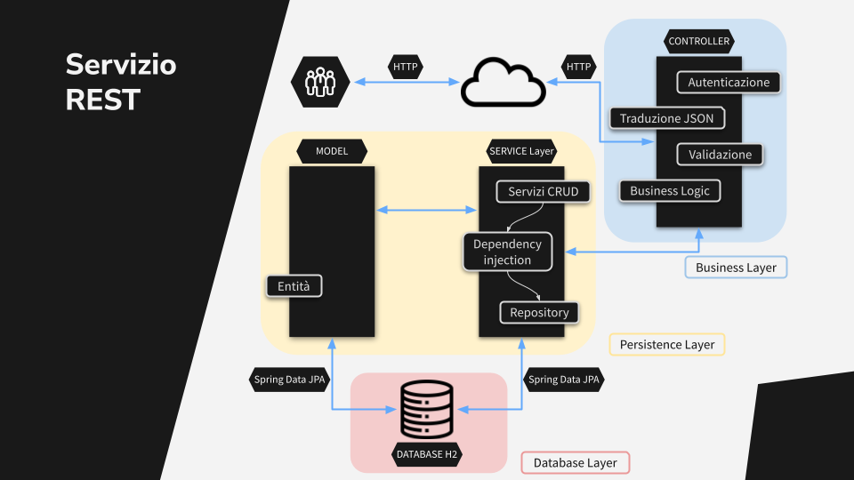
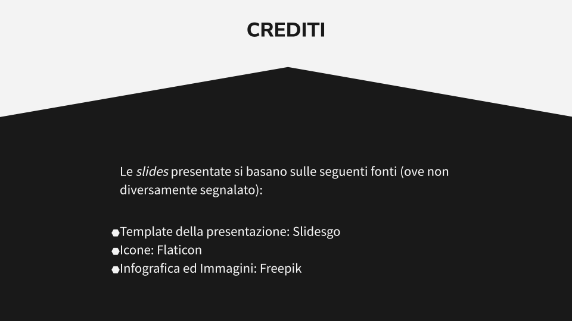

# Tesi

<!-- LOGO UNITO width="67" -->
 

  

  <h3 align="center">Realizzazione di un Servizio REST per la Validazione dei Codici Bancari</h3>

  

    Tesi di Laurea presso l'Università degli Studi di Torino, Anno Scolastico 2022/2023.
     
     
    <a href="https://github.com/Magitman/Tesi/blob/main/Realizzazione%20di%20un%20servizio%20REST%20per%20la%20validazione%20dei%20codici%20bancari.pdf"><strong>Tesi</strong></a>
     
     
    <a href="https://github.com/Magitman/Tesi/blob/main/Presentazione/Presentazione%20Tesi.pdf">Presentazione</a>
    ·
    <a href="https://github.com/Magitman/Tesi/tree/main/Latex%20Project">Progetto Latex</a>
  

 
 

<!-- TABLE OF CONTENTS -->
## Sommario
<ol>
  <li><a href="#Introduzione-Tesi">Introduzione Tesi</a></li>
  <li><a href="#Stage">Stage</a></li>
  <li><a href="#Tecnologie">Tecnologie</a></li>
  <li><a href="#Architettura">Architettura</a></li>
  <li><a href="#Back-end">Back-end</a></li>
  <li><a href="#Front-end">Front-end</a></li>
  <li><a href="#Conclusioni">Conclusioni</a></li>
  <li><a href="#Crediti">Crediti</a></li>
</ol>

<!-- TESI -->
## Introduzione Tesi

  

Sono <a href="https://www.linkedin.com/in/luca-broggiato-639154188/" target="_blank">Luca Broggiato</a> e questa è la presentazione della mia tesi di laurea, intitolata “Realizzazione di un servizio REST per la validazione dei codici bancari”. La stesura è stata possibile anche grazie al prezioso aiuto e supporto della mia relatrice, la docente <a href="https://www.linkedin.com/in/liliana-ardissono-1007508/" target="_blank">Liliana Ardissono</a>, ed i tutor che si sono avvicendati in azienda, i dottori <a href="https://www.linkedin.com/in/paolo-mino-a284653b/" target="_blank">Paolo Mino</a> e <a href="https://www.linkedin.com/in/antonio-zollino-43638346/" target="_blank">Antonio Zollino</a>.
 
 

<!-- INDICE -->

  

La presentazione è composta da 6 sezioni, ognuna riguardante un tema specifico, per illustrare la mia esperienza di tirocinio curriculare ed il progetto che ho potuto realizzare.

<!-- STAGE -->
## Stage

  

Si presenta innanzitutto l'esperienza di stage esterno.
 
 

  

Il tirocinio curriculare che ho svolto si è tenuto presso l’azienda multinazionale <a href="https://www.alten.it" target="_blank">Alten</a>. Si tratta di una società di consulenza informatica fondata in Francia a fine anni ‘80 e che attualmente è presente in oltre 30 Paesi in tutto il mondo. Anche in Italia, è presente nelle principali città del territorio, offrendo servizi di consulenza in ambito informatico, ingegneristico e delle scienze della vita. Il team in cui sono stato inserito è multidisciplinare, composto quindi da figure di sviluppatori back-end, front-end e full-stack, oltre che da manager di progetto e altre figure di team leading. Si tratta anche di un gruppo lavorativo dislocato sul territorio, con persone operative e connesse da varie città italiane. Infine, l’azienda cliente, che ha commissionato il progetto che ho realizzato, è un gruppo bancario che ricopre un ruolo importante all’interno del perimetro geografico europeo.
 
 

  

Per quanto riguarda il progetto, l’obiettivo principale era quello di realizzare un servizio che fosse in grado di validare codici IBAN, implementando anche un’interfaccia web che permettesse ad utenti ed operatori del gruppo bancario di interagire con l’applicativo. In particolare, il servizio back-end espone un API REST che valida l’ID bancario inviato e tiene traccia delle richieste dei client in un database. Il punto d’ingresso del servizio, utilizzabile dagli utenti, ha richiesto lo sviluppo front-end di una pagina web per l’immissione dei dati e la visualizzazione dell’output, in modo che risultasse semplice, intuitivo e affidabile. Come si evince, la realizzazione del progetto ha richiesto la convergenza di competenze provenienti da diversi campi dello sviluppo software, da back-end a front-end. Questo approccio multidisciplinare è stato reso possibile anche dal contesto lavorativo mostrato nella slide precedente.

<!-- TECNOLOGIE -->
## Tecnologie

  

Passando alle tecnologie utilizzate nella realizzazione dell’applicativo, ho voluto suddividerle in modo da separare quelle usate per lo sviluppo front-end da quelle usate per il back-end.
 
 

  

Cominciando dal front-end, il framework su cui si basa la web-application è Angular, utilizzato per creare l’interfaccia utente dell’applicazione come Single Page Application. Questa è stata realizzata focalizzandosi sulla creazione e comunicazione dei componenti, elementi fondamentali per Angular che contengono la definizione di una vista all’interno della pagina. Ognuno è formato da un file di script TypeScript decorato con l’annotazione @Component, un modello HTML e stili CSS opzionali. La collaborazione tra questi elementi definisce l’aspetto ed il comportamento di ogni componente, e quindi della pagina stessa. La realizzazione del back-end, invece, è stata messa in pratica utilizzando il framework Spring Boot, che semplifica e velocizza lo sviluppo di applicazioni web basate su Spring, e quindi sul linguaggio di programmazione Java. Spring Boot consente allo sviluppatore di concentrarsi sulle funzionalità di business, occupandosi automaticamente della gestione delle risorse del sistema e fornendo supporto all’infrastruttura dell’applicazione. Inoltre, mette a disposizione i cosiddetti “starter”, ovvero set di dipendenze configurate automaticamente. Uno di questi è “spring data jpa”, parte del progetto Spring Data e che include tutte le dipendenze necessarie per comunicare con il database tramite JPA, acronimo di Java Persistence API. Spring Data JPA è un framework che fornisce un modello di programmazione per l’accesso ai dati in database relazionali e non, semplificando l’implementazione dei repository, ovvero le interfacce preposte alla comunicazione con la base dati. Oltre alle tecnologie citate, è stata realizzata una suite di test con Junit mentre il database è stato implementato in modalità in-memory con H2, un database management system relazionale scritto in Java e supportato da Spring Boot. Inoltre, il linguaggio SQL è stato utilizzato per dichiarare la struttura del database, nonostante questo sia formato da un’unica tabella in cui vengono memorizzate le richieste dei client. Per concludere, lo strumento di build utilizzato è Maven, che si occupa della compilazione dei file sorgenti in eseguibili e gestisce l’integrazione ed il download delle dipendenze esterne all’interno del progetto.

<!-- Architettura -->
## Architettura

  

Si mostra quindi l’architettura globale del progetto.
 
 

  

Gli utenti si interfacciano con l’applicazione attraverso la pagina web realizzata con Angular, che funge da entrypoint per l’immissione dei dati e  fornisce l’output visivo dell’elaborazione. Una volta compilato un form, la richiesta viene inoltrata al back-end tramite il protocollo HTTP, dove i dati vengono controllati e processati dal servizio REST esposto. Se le informazioni presenti nella richiesta rispettano i formati ed i pattern impostati, allora viene prelevato il codice IBAN ricevuto per contattare un servizio esterno, messo a disposizione da ANYAPI, che ne verifica la validità. Il risultato di questa chiamata viene memorizzato nel database insieme ai dati forniti con la richiesta utente. Infine, si inoltra una risposta HTTP al client contenente i dati che indicano la validità del ID bancario in formato JSON.

<!-- BACK-END -->
## Back-end

  

Avanzando con la presentazione, si analizza più nel dettaglio quello che è il back-end del progetto realizzato.
 
 

  

Per cominciare, il servizio REST esposto segue un’architettura formata da 3 livelli, ognuno che comunica con il precedente e con il successivo. Questi sono:
<ul>
  <li>il livello di business: che si occupa della gestione delle richieste HTTP, dell’autenticazione e della traduzione dei dati JSON in oggetti Java. Inoltre, comprende le regole e la logica di business dell’applicazione, inclusa la validazione dei dati, che determinano quali azioni compiere;</li>
  <li>il livello di persistenza: che gestisce la logica di memorizzazione e traduce gli oggetti di business da e verso il database;</li>
  <li>il livello di database: che rappresenta la base dati utilizzata per gestire i dati dell’applicazione.</li>
</ul>
Come si evince dallo schema, alcuni dei componenti rappresentati (in particolare CONTROLLER e MODEL) sono un chiaro riferimento al design pattern su cui si basa il servizio: il pattern MVC.
 
 

  

Nel contesto di un servizio web REST sviluppato con Spring Boot, si semplifica l’uso del design pattern MVC (Model View Controller). In questo modo:
<ul>
  <li>il Model rappresenta i dati e le risorse. Nella slide infatti è presente la classe Entità utilizzata per mappare i dati da e verso la tabella del database;</li>
  <li>la View non è la pagina web mostrata all’utente ma è sostituita dalla rappresentazione dei dati inviati ai client in formato JSON. Qui sono riportati i valori di ritorno quando l’IBAN è valido, in verde, e quando invece non lo è, in rosso, con tanto di codice e descrizione testuale dell’errore;</li>
  <li>il Controller, invece, coordina le richieste ed è implementato con le annotazioni @RestController (trattandosi di un servizio REST) e @RequestMapping (per l’esposizione del servizio); inoltre, contiene la logica di business, occupandosi di mappare il JSON in un oggetto Java e controllando la validità del codice IBAN (comunicando con l’API esterna).</li>
</ul>
Infine, tramite la comunicazione tra livello di business e livello di persistenza, il controller comunica con il repository per memorizzare le richieste all’interno del database.
 
 

  

Dato che la validazione vera e propria del codice IBAN inviato dai client è affidata ad un servizio esterno, esposto da ANYAPI, è stato necessario impostare il back-end affinché potesse effettuare una richiesta HTTP. In questi casi, una volta che si è a conoscenza del formato del JSON ritornato dalla risorsa esterna, si procede con la creazione di un Data Transfer Object. Si tratta di un oggetto Java utilizzato per lo scambio di dati ed impiegato per mappare la risposta. Inoltre, al fine di migliorare la leggibilità e la coesione del codice, si è scelto di dichiarare le variabili contenenti il link e la chiave dell’API esterna nel file di configurazione application.properties. Questo processo rispetta le best practice per il riutilizzo e la contestualizzazione del codice. Infine, per effettuare il processo di richiesta vero e proprio, Spring Boot mette a disposizione la dipendenza RestTemplate, che svolge un ruolo fondamentale nella comunicazione con i servizi esterni poiché permette di effettuare richieste HTTP sincrone. E’ importante controllare sempre il valore di ritorno prima di utilizzarlo, poiché in caso di errore durante la richiesta il DTO sarà impostato a null.

<!-- FRONT-END -->
## Front-end

  

Una volta compresa la struttura ed il funzionamento del servizio back-end, si analizza il comparto front-end del progetto.
 
 

  

Il front-end dell’applicazione si basa interamente sul framework di sviluppo Angular, utilizzato per creare l’interfaccia utente dell’applicazione come Single Page Application. Si tratta di uno dei framework più utilizzati in quest’ambito e gode del supporto di quasi 2 milioni di sviluppatori, autori di librerie e creatori di contenuti. La web-application è stata realizzata focalizzandosi sulla creazione e sulla comunicazione dei componenti, resa possibile dagli script TypeScript. Inoltre, questi elementi architetturali, fondamentali per creare applicazioni scalabili, sono formati anche da un template HTML e fogli di stile CSS, per definire il layout del componente e assegnarli uno stile personalizzato. Oltre a ciò, gli elementi del template HTML possono essere legati alle proprietà presenti nel file di script tramite quello che è definito two-way data binding. In questo modo, è possibile visualizzare e modificare i valori dinamicamente, rispondere ad un evento ed altro ancora. Altra caratteristica fondamentale di Angular sono le direttive, che influenzano l’aspetto, il comportamento o il layout del DOM (Document Object Module, ovvero il modello con struttura ad albero che rappresenta una pagina web). Le direttive possono essere:
<ul>
  <li>Component, rappresentate dall’omonimo decoratore, che fornisce la configurazione per determinare come un componente deve essere processato, istanziato e utilizzato a runtime;</li>
  <li>Strutturali, per inserire condizioni o cicli che permettono la modifica dinamica del DOM;</li>
  <li>Di attributo, che consentono la modifica dinamica dello stile degli elementi HTML.</li>
</ul>
Infine, il modulo HTTPClient permette di effettuare chiamate verso API RESTful e di interagire con servizi esterni. Mette a disposizione una struttura pipe per incanalare la risposta ricevuta ed eseguire operazioni sui dati prima di renderli disponibili nel codice, come ad esempio la gestione delle risposte HTTP in caso di errore.
 
 

  

Nel contesto Angular, i componenti sono i blocchi fondamentali che compongono un’applicazione, e nel caso della web-application realizzata per il progetto, ne sono stati creati 4:
<ol>
  <li>il componente form rappresenta il modulo per l’inserimento dei dati;</li>
  <li>il componente offline costituisce la schermata da visualizzare se il servizio back-end non è raggiungibile;</li>
  <li>il componente outcome mostra il risultato dell’elaborazione back-end, quando è raggiungibile;</li>
  <li>il componente top-bar è invece la barra superiore, presente in ogni schermata dell’applicazione.</li>
</ol>
I componenti Angular sono il cuore dell’applicazione. Ognuno di essi è responsabile di un aspetto specifico dell’interfaccia utente e la comunicazione avviene emettendo eventi personalizzati. Inoltre, come riportato nella slide, la scelta del componente da mostrare in pagina è effettuata tramite la direttiva di attributo “ngClass”, che permette di modificare la classe del relativo elemento HTML. Questo, grazie alle animazioni e alle transizioni impostate nel foglio di stile CSS, consente di mettere in primo piano un componente piuttosto che un altro a seconda della proprietà di riferimento.
 
 

  

Quindi, il risultato finale è quello mostrato nel diagramma di flusso. Partendo dal presupposto che il componente top-bar è sempre presente nella vista, quando gli utenti si interfacciano con la web-application atterrano sul componente form. Una volta compilato con i propri dati, viene eseguita una richiesta HTTP verso l’API REST esposta dal servizio back-end. Se questo risulta offline, viene subito mostrato l’omonimo componente, che informa l’utente circa lo stato del servizio. Da qui è possibile tornare al componente precedente e riprovare. Altrimenti, se il servizio è online, si controlla il JSON ritornato dal back-end e si attiva il componente outcome. Se la risposta non contiene errori e l’IBAN è valido, si segnala tale informazione, altrimenti viene mostrato a schermo il codice e la descrizione testuale dell’errore. In ogni caso, anche da questo componente è possibile tornare al form principale.

<!-- CONCLUSIONI -->
## Conclusioni

  

In conclusione, il progetto presentato è la prima versione del servizio di validazione IBAN, al quale seguiranno future implementazioni per migliorare l’infrastruttura esistente.
 
 

  

In particolare, due delle criticità già emerse rappresentano l’utilizzo di un’API remota e l’assenza di autenticazione da parte degli utenti. Per quanto riguarda la prima, si è discussa la possibilità di implementare un database, già esistente all’interno del gruppo bancario, che permetta di confrontare il codice inserito con quelli memorizzati. Questa modifica permetterebbe di aumentare le prestazioni, evitando il collegamento esterno, e soprattutto aumenterebbe la sicurezza del servizio. Per quanto riguarda l’autenticazione, invece, è emersa in fase di sviluppo la possibilità di far accedere utenti e operatori con le proprie credenziali, in modo da aumentarne l’affidabilità e sicurezza, garantendo solo accessi autenticati.

<!-- CREDITI -->
## Crediti

  

